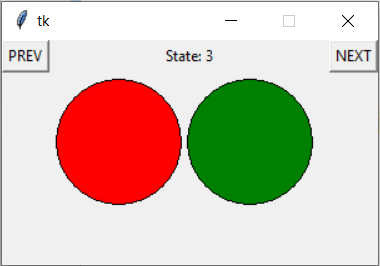
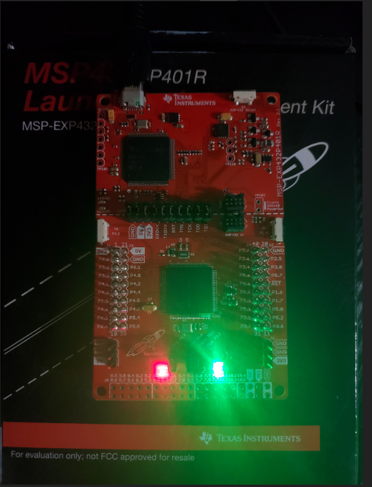

# StateMachine

------------------------------------------------------------------------
This is the project README file. Here, you should describe your project.
Tell the reader (someone who does not know anything about this project)
all he/she needs to know. The comments should usually include at least:
------------------------------------------------------------------------

* PROJECT TITLE: StateMachine
* VERSION or DATE: DEC 09, 2020
* AUTHORS: Mo'men Mushtaha
* PURPOSE OF PROJECT: LED State Machine using embedded C on MSP432P401R MCU. Python Tkinter GUI Monitor to control and reflect the changes on the MCU board using UART serial communication port

*
*
*

